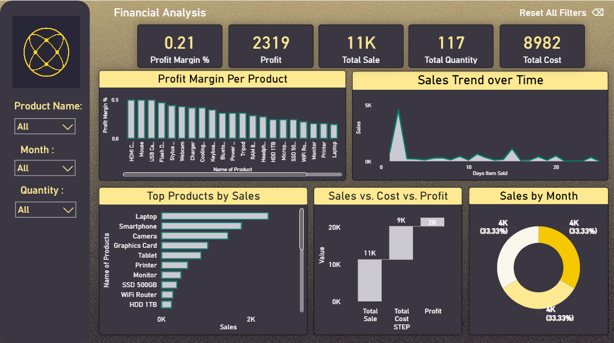
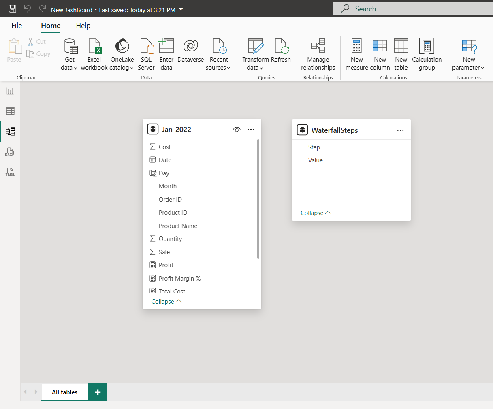
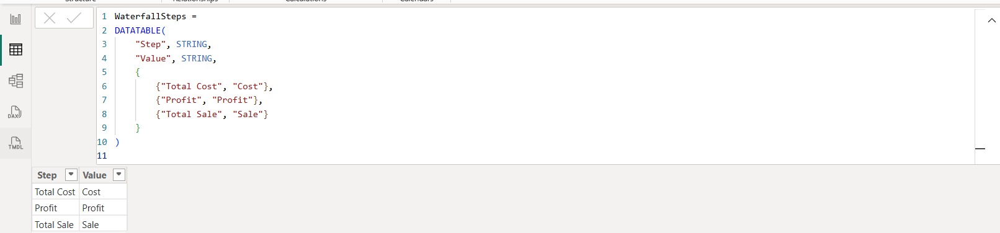

# 📊 Power BI Sales Dashboard 

---

## 📁 Table of Contents

1. [🔧 Project Overview](#-project-overview)
2. [📊 Dashboard Structure](#-dashboard-structure)
3. [🔁 Data Modeling & Cardinality](#-data-modeling--cardinality)
4. [🧮 DAX Measures & Calculated Tables](#-dax-measures--calculated-tables)
5. [📈 Visualizations Guide](#-visualizations-guide)
6. [🎛 Recommended Filters](#-recommended-filters)
7. [🎨 Design & Color Palette](#-design--color-palette)
8. [📌 Final Layout Summary](#-final-layout-summary)

---

## 🔧 Project Overview

This Power BI dashboard represents **sales data for January 2022**, stored in the `Jan_2022` table. It offers performance insights through KPIs, visualizations, and calculated metrics that help users understand sales trends, profitability, and product performance.

---

## 📊 Dashboard Structure

The dashboard is broken down into three key sections:

| Section        | Purpose                                           |
| -------------- | ------------------------------------------------- |
| **Top**        | High-level KPIs (Sales, Profit, Quantity, Margin) |
| **Middle**     | Charts: Trends, Products, Profitability           |
| **Bottom**     | Interactive table/matrix or drill-down visuals    |
| **Right Pane** | Filters/slicers for interactivity                 |

 *(*

---

## 🔁 Data Modeling & Cardinality

### 📂 Source Table

- `Jan_2022` — Contains fields like `Date`, `Order ID`, `Product Name`, `Cost`, `Sale`, and `Quantity`.

### 🔄 Cardinality

Currently, a **single table** is used, so no relationships are necessary. If you expand this model:

- Link a **Products** table (`Product ID`) → `Jan_2022[Product ID]`
- Link a **Calendar** table → `Jan_2022[Date]`

Use **"Many-to-One"** relationships with **single direction filtering**.

🔗 *(Insert ER diagram image or relationship pane screenshot)*

---

## 🧮 DAX Measures & Calculated Tables

### ✅ DAX Measures

```dax
Total Sale = SUM(Jan_2022[Sale])

Total Cost = SUM(Jan_2022[Cost])

Total Quantity = SUM(Jan_2022[Quantity])

Profit = [Total Sale] - [Total Cost]

Profit Margin % = DIVIDE([Profit], [Total Sale], 0)
````

---

### 🧮 Calculated Columns / Tables

#### 🔹 Day Column:

```dax
Day = DAY(Jan_2022[Date])
```

#### 🔹 Profit Category:

```dax
Profit Category = IF([Profit] > 0, "Profitable", "Loss")
```

#### 🔹 Waterfall Step Table:

```dax
WaterfallSteps = 
DATATABLE(
    "Step", STRING,
    "Value", STRING,
    {
        {"Total Cost", "Cost"},
        {"Profit", "Profit"},
        {"Total Sale", "Sale"}
    }
)
```

🔗 *(Insert animation/GIF of adding DAX measures)*

---

## 📈 Visualizations Guide

Each visual adds specific value to the dashboard:

---

### 📉 1. Line Chart – Sales Trend

* **X-Axis**: `Day`
* **Y-Axis**: `Total Sale`
* Shows how revenue changes daily over the month.

---

### 📊 2. Bar Chart – Top Products by Sale

* **Axis**: `Product Name`
* **Values**: `Total Sale`
* **Sort**: Descending
* Shows best-performing products.

---

### 🧁 3. Donut Chart – Product Share by Sale

* **Values**: `Total Sale`
* **Legend**: `Product Name`
* Best for proportion views of total sales.

---

### 📉 4. Waterfall Chart – Cost to Revenue Breakdown

* **Category**: `Step` (from WaterfallSteps table)
* **Values**: `Waterfall Value` measure (based on Cost, Profit, Sale)
* Shows how costs add up to total sales.

---

### 🎯 5. Gauge Chart – Total Sales vs. Target

* **Value**: `Total Sale`
* **Max**: Manual target (e.g., 10,000)
* Quickly shows if target was achieved.

---

### 🧊 6. Heatmap or Matrix – Optional Detail View

* **Rows**: `Product Name`
* **Columns**: `Order ID`
* **Values**: `Quantity`, `Sale`
* Color formatting for quick visual cues.

---

## 🎛 Recommended Filters

| Filter Name         | Field             | Style    | Reason                          |
| ------------------- | ----------------- | -------- | ------------------------------- |
| **Product Name**    | `Product Name`    | Dropdown | Focus on specific product sales |
| **Month**           | `Month`           | Dropdown | Time-based slicing              |
| **Profit Category** | `Profit Category` | List     | Show only profitable/loss items |
| **Quantity Range**  | `Quantity`        | Slider   | Focus on high/low volume sales  |



---

## 🎨 Design & Color Palette

### 💡 Chosen Theme: Ocean Breeze

| Element        | Color      | Hex Code  |
| -------------- | ---------- | --------- |
| Primary Accent | Deep Teal  | `#00796B` |
| Background     | Snow White | `#FAFAFA` |
| Labels/Text    | Slate Grey | `#37474F` |

Use accent color for KPIs and visual highlights. Keep layout clean with plenty of white space.



---

## 📌 Final Layout Summary

```
[Top Row]
- KPI Cards: Total Sale | Total Cost | Profit | Margin %

[Middle Row]
- Line Chart (Sales Trend)
- Bar Chart (Top Products)
- Donut Chart (Sales Share)

[Bottom / Right]
- Waterfall Chart
- Gauge Chart
- Filters: Product Name | Month | Profit Category | Quantity
```

---

## 📎 Notes

* Always refresh your dataset before publishing.
* Maintain naming consistency in DAX measures.
* Test filters across visuals to confirm sync.

```
